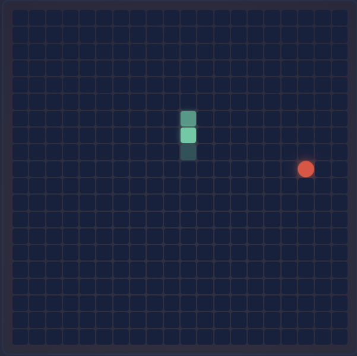

React Snake Game

Классическая игра "Змейка", реализованная на React и TypeScript

  

📋 О проекте

React Snake – это современная реализация классической игры "Змейка" с использованием React, TypeScript и Zustand для управления состоянием. Проект демонстрирует практическое применение современных веб-технологий в контексте простой, но увлекательной игры.

✨ Особенности
🎮 Классический геймплей с современной реализацией
🎨 Стильный дизайн с использованием CSS Modules
📊 Система подсчета очков
🚀 Адаптивное увеличение сложности – скорость змейки растет по мере набора очков
📱 Адаптивный интерфейс для разных устройств
⚡ Высокая производительность благодаря Vite и оптимизированному рендерингу

🛠️ Технологии
React – библиотека для построения пользовательских интерфейсов
TypeScript – для типизации кода и предотвращения ошибок
Vite – быстрый инструмент сборки для современных веб-приложений
Zustand – минималистичный и интуитивно понятный менеджер состояний
CSS Modules – для изолированных и модульных стилей

🚀 Установка и запуск

Требования
Node.js (14.x или выше)
npm или yarn

Шаги по установке

После запуска откройте http://localhost:5173 в вашем браузере.

🎮 Как играть
Управление змейкой:
Используйте стрелки на клавиатуре (↑, →, ↓, ←) для изменения направления движения
Змейка постоянно движется в выбранном направлении
Цель игры:
Собирайте красные точки (еду) на игровом поле
С каждой собранной точкой змейка становится длиннее, а счет увеличивается
Скорость змейки также постепенно увеличивается с ростом счета
Условия проигрыша:
Столкновение со стенами игрового поля
Столкновение с собственным телом змейки
После проигрыша:
Нажмите кнопку "Начать заново" для новой игры
Ваш лучший результат будет сохранен в истории

🔧 Архитектура проекта

🔍 Возможные улучшения
Добавление мобильного управления (свайпы для смены направления)
Режимы сложности (разные скорости, препятствия)
Поддержка мультиплеера (локальный или онлайн)
Таблица рекордов с сохранением в localStorage
Настраиваемые темы (светлая/темная, различные цветовые схемы)
Звуковые эффекты для улучшения игрового опыта

🧪 Тестирование

📄 Лицензия

Этот проект распространяется под лицензией MIT. Смотрите файл LICENSE для получения дополнительной информации.

👨‍💻 Автор
Foxeleon

💡 Интересный факт: Игра "Змейка" была впервые представлена в 1976 году на аркадной игре Blockade, а по-настоящему популярной стала благодаря версии на мобильных телефонах Nokia в конце 1990-х годов.